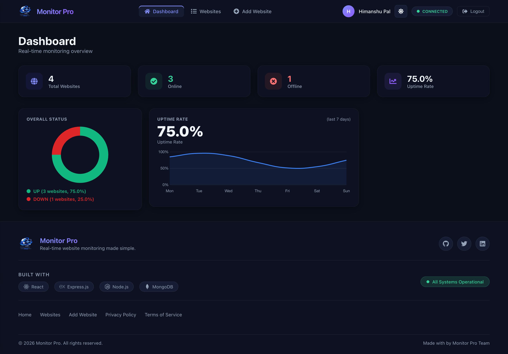
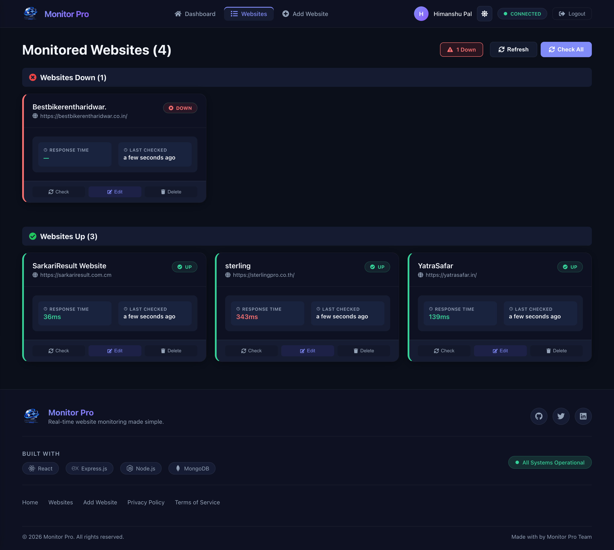
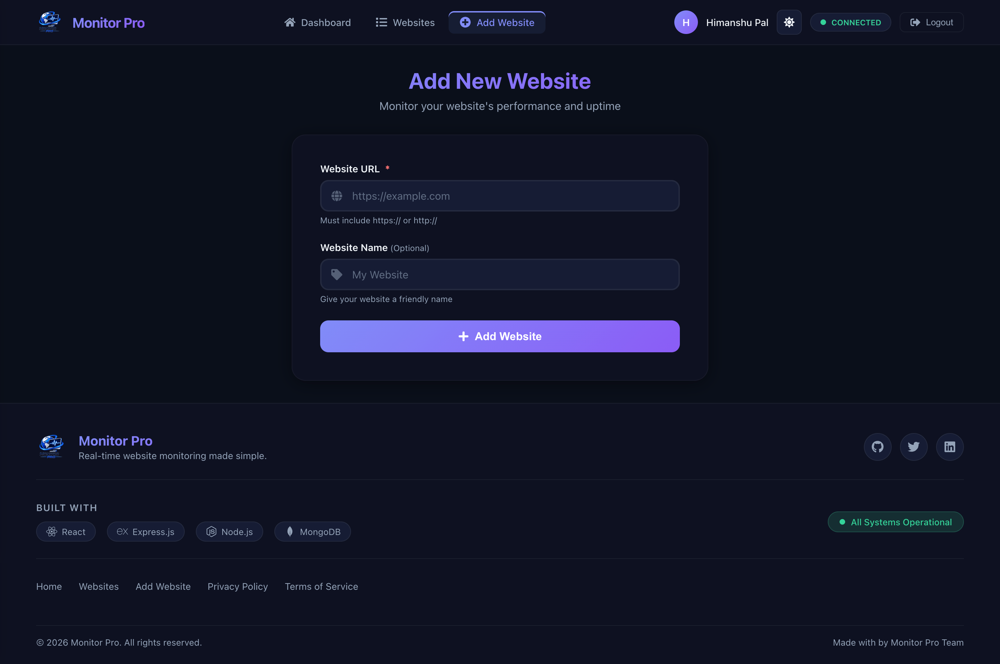

# 🌐 Website Monitor

A full-stack **real-time website uptime monitoring** application built with **React + Vite** on the frontend. Monitor your websites, track their UP/DOWN status, and get instant visual feedback — all in one place.

## 📸 Screenshots

### 📊 Dashboard


### 📋 Websites List


### ➕ Add Website


---

## ✨ Features

- 🔐 **Authentication** — Secure login, register, forgot password & reset password
- 📊 **Dashboard** — Live stats showing total, UP, DOWN, and checking websites
- 📋 **Websites List** — View all monitored websites with real-time status
- ➕ **Add Website** — Quickly add any URL to monitor
- ✏️ **Edit / Delete** — Manage your monitored websites easily
- 🔄 **Auto Refresh** — Status auto-updates every 30 seconds
- 📈 **Charts** — Donut chart & uptime line chart for visual analytics
- 🌗 **Dark / Light Theme** — Toggle between dark and light mode
- 📱 **Responsive** — Works on desktop and mobile

---

## 🛠️ Tech Stack

| Layer | Tech |
|-------|------|
| Frontend | React 18, Vite |
| Routing | React Router DOM v7 |
| HTTP Client | Axios |
| Charts | Chart.js, React-Chartjs-2 |
| Alerts | SweetAlert2 |
| Icons | React Icons |
| Dates | Moment.js |
| Deployment | Vercel |

---

## 📁 Project Structure

```
Website-Moniter/
├── public/
├── src/
│   ├── components/
│   │   ├── Auth/         # Login, Register, ForgotPassword, ResetPassword
│   │   ├── Dashboard/    # Stats overview
│   │   ├── WebsitesList/ # All monitored sites
│   │   ├── AddWebsite/   # Add new site form
│   │   ├── Charts/       # Donut & Line charts
│   │   ├── Navbar/       # Top navigation
│   │   └── Footer/       # Footer component
│   ├── App.jsx
│   ├── App.css
│   └── main.jsx
├── .env
├── vite.config.js
├── vercel.json
└── package.json
```

---

## 🚀 Getting Started

### 1. Clone the repository

```bash
git clone https://github.com/your-username/website-monitor.git
cd website-monitor
```

### 2. Install dependencies

```bash
npm install
```

### 3. Configure environment variables

Create a `.env` file in the root directory:

```env
VITE_API_URL=http://localhost:5000/api
```

### 4. Run the development server

```bash
npm run dev
```

The app will be available at `http://localhost:5173`

---

## 🏗️ Build for Production

```bash
npm run build
```

---

## ☁️ Deploy on Vercel

This project includes a `vercel.json` for easy Vercel deployment.

1. Push your code to GitHub
2. Import the repo on [vercel.com](https://vercel.com)
3. Set the `VITE_API_URL` environment variable to your backend URL
4. Click **Deploy** ✅

---

## 📡 API Endpoints (Backend)

> Make sure your backend server is running. The frontend connects to `VITE_API_URL`.

| Method | Endpoint | Description |
|--------|----------|-------------|
| GET | `/api/websites` | Get all monitored websites |
| POST | `/api/websites` | Add a new website |
| PUT | `/api/websites/:id` | Update a website |
| DELETE | `/api/websites/:id` | Delete a website |
| POST | `/api/websites/:id/check` | Check a single website |
| POST | `/api/websites/check/all` | Check all websites |

---

## 🤝 Contributing

Pull requests are welcome! For major changes, please open an issue first.

---

## 📄 License

[MIT](LICENSE)

---

> Made with ❤️ using React + Vite